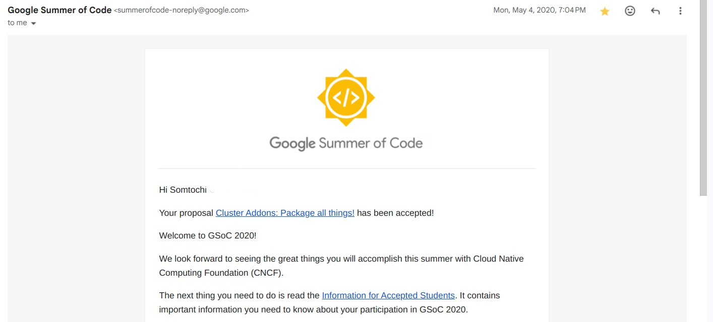

This blog post is about five years too late. I got into Google Summer of Code in 2020 and have been meaning to write one, but I kept putting it off. Since I still get occasional messages from people trying to get in, and the application period is closed, I decided to finally sit down and get it done. Getting into the program quite literally changed my life. I learnt a whole lot and connected with lifelong mentors (hi [Leighhhh](https://www.linkedin.com/in/leighcs) 💓!). This post is mostly around getting into Google Summer of Code, but the tips are general enough that they apply to other open-source internships, and there are many others like [Outreachy](https://www.outreachy.org/), [MLH](https://fellowship.mlh.io/), [LFX Mentorship](https://lfx.linuxfoundation.org/tools/mentorship/) etc.

## Maybe an intro on why you should care?

If you are just getting started in tech, have a solid knowledge of one or two programming languages, have built some personal projects, and you are looking for a way to level up your skills and get paid while at it, open-source internships are where it is. You get a chance to contribute to an active project, get feedback and reviews from experienced people and join a great community while getting paid (in $$). There are seasoned engineers from big tech companies and fast-paced startups in these communities, and you also get a chance to connect with them. Each project idea has specific mentors, and you get guidance throughout the internship period.

When I first applied to GSoC in 2019 (yes, I applied twice, it is okay if you don’t get in the first time), I only started to look at organizations during the application period, and just managed to scrape together a proposal. But when the next application season came around, I was ready.

## Start early

The most important thing you can do to increase your chances is to start early, like wayy before the application period begins. Get involved and start contributing as soon as you can.
Of course, organizations would pick someone who has already been contributing for a while.  The person would also have a better proposal because they have more knowledge about the project. You can stop reading right now. That’s it. What follows are just tips to help with decisions, picking a project, etc. But at the core of it is to pick a project that aligns with what you are interested in  (language that you know, and doing something you are interested in) and making meaningful contributions early. (Please, please don’t be one of those people who make random, empty contributions that add to maintainer burden; this wouldn’t help AT ALL.)

## Pick an organisation

It helps if you are genuinely interested in the project, and it aligns with your experience. It is much easier to be a consistent contributor if the project intrigues you. The Google summer of codede archive page](https://summerofcode.withgoogle.com/archive)  has tabs to check organizations in particular areas like Machine Learning.

Take a look at what they do, read through their docs. Some repositories have a [`CONTRIBUTING.md`](http://CONTRIBUTING.md) file that contains information for new contributors. You can join a couple of communities before settling on one, introduce yourself as a new contributor, try to understand what the project is about and ask what are good first steps to take, Most communities are very welcoming, but I tried to look out for more active communities since you’d get responses faster.

You can select two organisations, but I selected just one (Cloud Native Computing Foundation). I found it easier to focus all my efforts on one; most of them are big enough that they have multiple project ideas during GSoC, so you can still submit two or three proposals.

## Contribute!

This is where the work lies. It's not enough to just join these communities. You have to actually contribute. It is okay if it feels overwhelming at first. The project is probably years of work and has evolved - you can’t understand it all within a week. Most organizations have a bunch of repositories, but there’s normally one or two core ones. I’d advise starting with those or whichever piques your interest.

Start small. Some repositories have labelled issues that indicate the level of difficulty. It doesn’t have to be code; you can start with documentation. Go through the docs and demos - you might find something that’s broken or doesn’t work as stated. Add new tests or fix an easy issue that no one has gotten around to. You can also simply ask - ‘ Hi, I am a new contributor and I’m excited to get started, are there any good issues that’d be great to pick?’.

Join the community meetings and try to be a part of the discussion.  Ask questions when you are confused. Be open to reviews on your pull request, each code base has its own styles and entrenchment. Don’t get stressed because there are a lot of review comments - just carefully go through them and make the necessary changes.

But don’t get stuck in the small things; the goal over time is for you to progress to handling bigger issues. With time and effort, you’ll become a regular contributor. Check out other people’s pull requests and issues too, don’t be afraid to make suggestions or open new issues that you might have discovered.

## Put in maximum effort during the proposal period:

It is possible that the part of the project that you’ve been working on is different from the ones the organization will submit as its project ideas. When you discover this, shift your effort to that area. Start contributing there, join the meetings if it is different from the ones you have been attending. Understand what the project idea is about and what they’re trying to achieve.

Aim to write a very solid proposal. Bring fresh ideas to the table, and clearly break down your plan into achievable milestones over the three-month period. Take a look at past accepted proposals to get some inspiration. My friend created a repository containing proposals from different organizations [here](https://github.com/prondubuisi/accepted-gsoc-proposals).

That’s it! I hope this helps. Best of luck 💫

If you are curious about what I worked on during the GSoC period. Here’s a link to a blog post around it. https://kubernetes.io/blog/2020/09/16/gsoc20-building-operators-for-cluster-addons/
